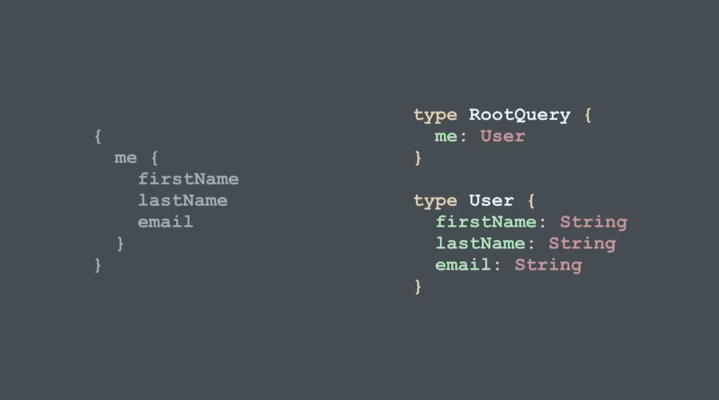

import { Split, FullScreenCode } from 'mdx-deck/layouts'
import { Appear } from 'mdx-deck'

export { code as theme } from 'mdx-deck/themes'

# An Introduction to GraphQL

---

# Let's start with APIs

---

## REST APIs

---


---

# RESTful APIs are optimized for servers, not clients

---

## what if we wanted to put clients first?

---

# backends for frontends

---


---

## but this only works if you are in control of the client

---

## what about a public API?

---

# enter GraphQL

---

## a data query language

---

# GraphQL is a specification created by Facebook

---

# created by Facebook

---

## Hello World in GraphQL

```jsx
{
  me {
    firstName
    lastName
    email
  }
}
```

---

## if I execute this

---

#### Request

```jsx
{
  me {
    firstName
    lastName
    email
  }
}
```
#### Response

```jsx
{
  "data": {
    "me: {
      "firstName": "Srdjan",
      "lastName": "Rakic",
      "email": "srdjan@inplayer.com"
    }
  }
}
```
---

### the query defines the structure of the response

```jsx
{
  user(name: "Srdjan Rakic") {
    firstName
    occupation
  }
}
```
#### Response

```jsx
{
  "data": {
    "user": {
      "firstName": "Srdjan",
      "occupation": "deBeloper",
    }
  }
}
```
---

## GraphQL is typed

---



---

## GraphQL is intospectable

---

### documentation and client generation, are free

---


